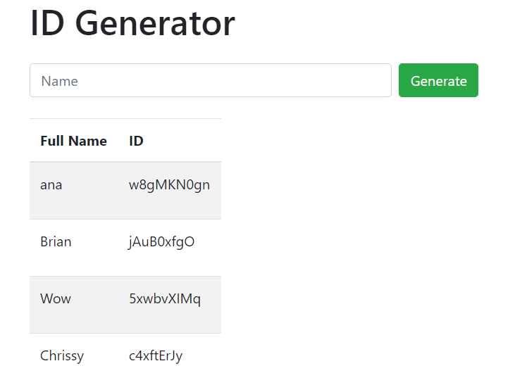
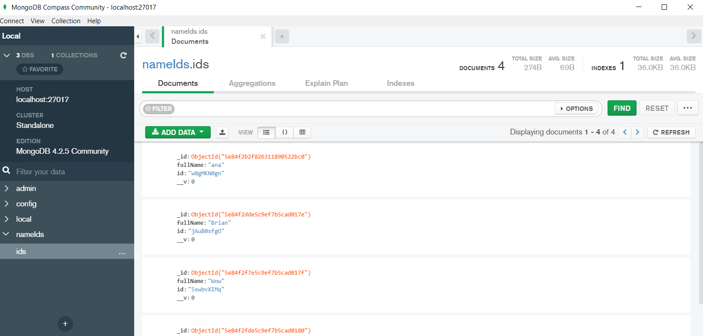

# MongoDB-IDs

This is a sample project of using MongoDB with express server. I've used dynamic routes and mongoose to vonnect to MongoDB database on my computer.
I've also used MongoDB GUI to test the app and to see the end result of the database entry.
Here how it looks like on the localhost:

Here are the results in MongoDB GUI:

